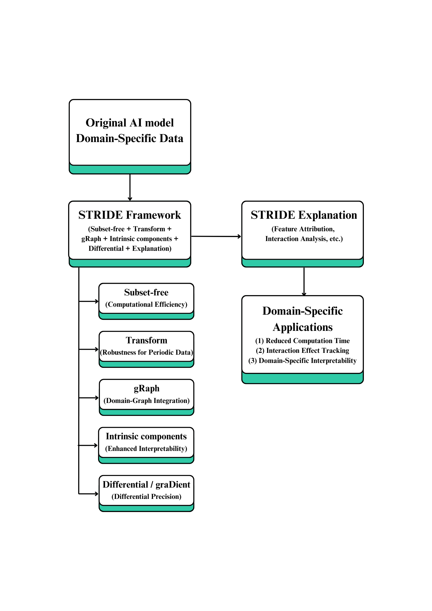
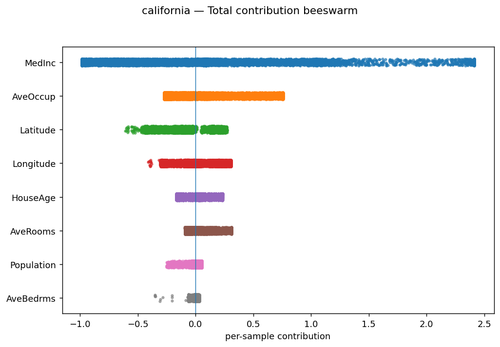
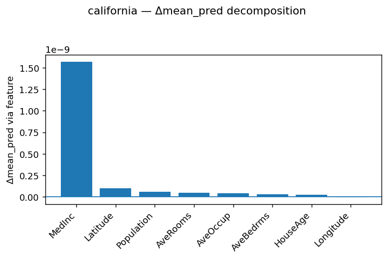
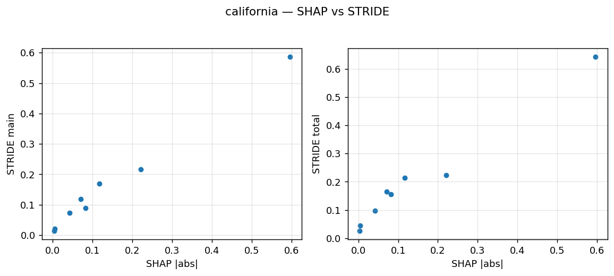
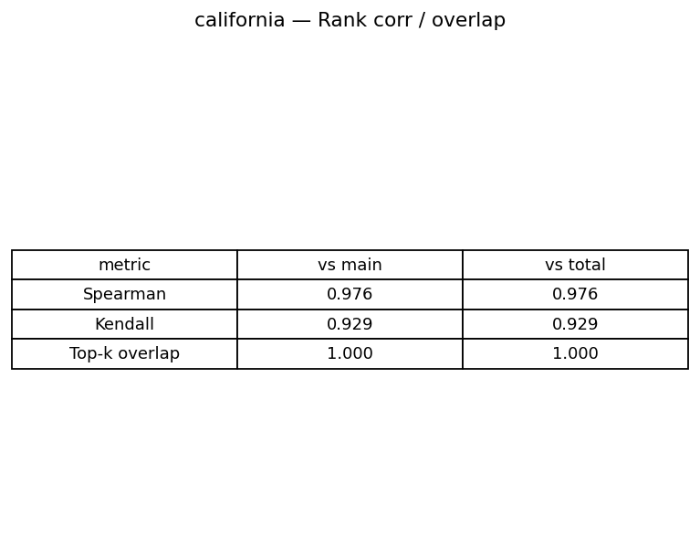
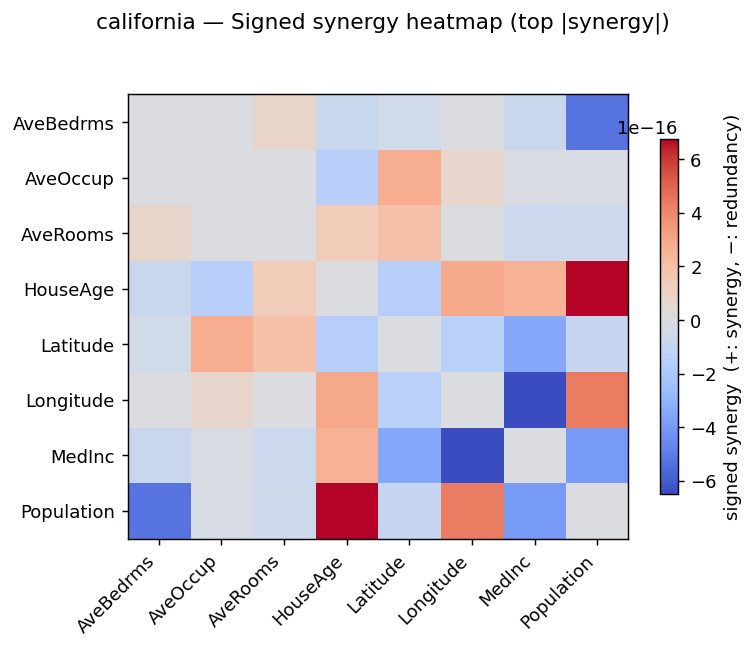
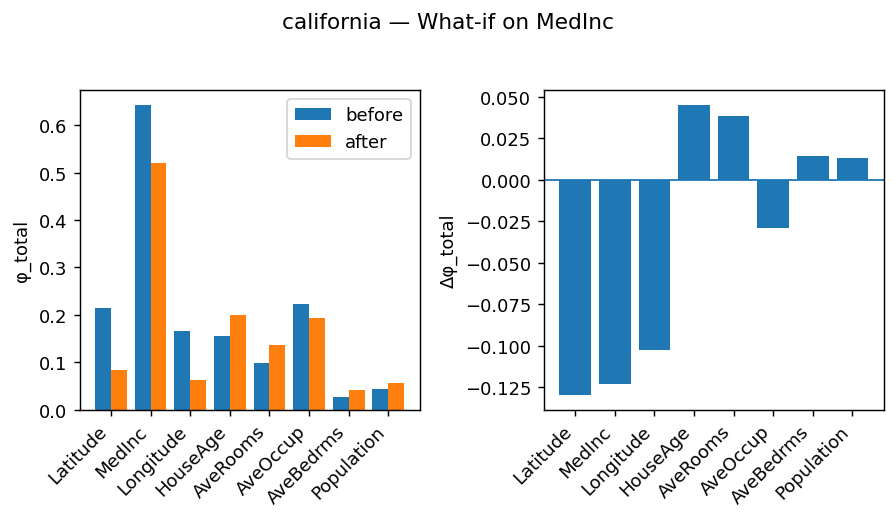

# STRIDE: A Novel Kernel-Based Framework for Explainable AI

**IEEE TNNLS Submitted (Under Review) & Patent-Pending**

A novel kernel-based XAI framework designed to overcome the theoretical and computational limitations of traditional methods like SHAP. Developed by **Chaeyun Ko** as part of a Master's thesis in Applied Mathematics at Ewha Womans University.

[**[View Full Technical Overview PDF]**](STRIDE_Portfolio_v2.0_20250824_Eng_ChaeyunKo.pdf) | [**[My LinkedIn Profile]**](https://www.linkedin.com/in/chaeyunko)

---

## Core Idea & Vision

My journey into AI began not with code, but with a question: What are the fundamental mathematical truths that govern this artificial "intelligence"? STRIDE is the culmination of this inquiry, a framework grounded in the philosophy of transforming deep theoretical insights into tangible, real-world impact.

It introduces a new paradigm for model interpretation based on **Orthogonal Decomposition in Reproducing Kernel Hilbert Space (RKHS)**, moving beyond the combinatorial limitations of Shapley-value-based approaches.

---

## Key Results & Capabilities

STRIDE's efficacy is validated through its comprehensive explanation suite, superior performance, and unique analytical functions.

### 1. Comprehensive Explanations (Global & Local)
STRIDE masters the fundamentals of XAI, providing both high-level overviews and granular, instance-specific analyses.

| Global Explanation (Beeswarm Plot) | Local Explanation (Delta Breakdown) |
| :---: | :---: |
|  |  |

### 2. Superior Performance & Reliability
The framework delivers a significant speedup over industry standards without sacrificing the integrity of the explanations. The speed is quantified in the table in our [Technical Overview](STRIDE_Portfolio_v2.0_20250824_Eng_ChaeyunKo.pdf), and the reliability is visualized below.

| High Value Correlation with TreeSHAP | High Rank Correlation with TreeSHAP |
| :---: | :---: |
|  |  |

### 3. Unique Analytical Functions Beyond Attribution
STRIDE is more than just a faster SHAP. It represents a new frontier in XAI, enabling deeper insights and providing dynamic, simulation-based tools for proactive decision-making.

| Interaction Synergy Heatmap | What-if Analysis Simulation |
| :---: | :---: |
|  |  |

---

## Intellectual Property & Source Code

The core algorithms and system architecture of the STRIDE framework are proprietary and protected by a pending patent (App. No. 10-2025-0044029).

This repository serves as a high-level overview and portfolio of the project's goals, methodology, and key results. The full source code is maintained in a private repository. I would be happy to discuss the architecture and key implementation details in an interview setting. Please feel free to reach out.
